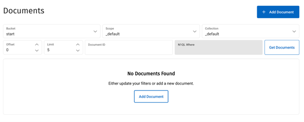

Objective:
==========

One of the biggest challenges for developers is to create enough
meaningful data for testing purposes. It could be for functional
testing, or stress test. This document is to highlight one of the
possible solutions to create sufficient random sample sets by leveraging
the power of the Couchbase, a modern data platform.

Outcome:
========

By following the document, users should be able to create a set of json
documents with meaningful data within a very short period of time. In
this example, we will create 100M JSON documents with meaningful airline
data, within a few mins.

Prerequisite:
=============

-   A Capella account
    ([https://cloud.couchbase.com](https://cloud.couchbase.com))

-   Adequate credits on Capella for configuring a cluster for the
    exercise.

    -   *For generating 100M documents within a few mins, you will use
        approximately 100 credits, you can reduce the configuration or
        generate less data to lower costs.*

**NOTE:** 
---------

**PLEASE DO NOT USE THIS ON A CLUSTER WITH PRODUCTION WORKLOAD. THIS
METHOD IS DESIGNED TO EXHAUST ALL CLUSTER RESOURCES TO COMPLETE THE DATA
GENERATION AS SOON AS POSSIBLE. THIS WILL SIGNIFICANTLY IMPACT ANY OTHER
WORKLOAD WITHIN THE CLUSTER. ALSO BE AWARE OF COST IMPLICATIONS BEFORE
PROCEEDING.**

Approach
========

The concept with this exercise is to leverage the Couchbase Capella Data
and Eventing Services running in memory to finish the ingestion as fast
as possible.

The Couchbase Capella Eventing service acts as a database trigger by
monitoring all the mutations on the Data Service based on the [Data
Change
Protocol](https://www.couchbase.com/blog/couchbases-history-everything-dcp/)
(DCP).

The Eventing Service leverages JavaScript functions to program the
business logic, the approach is to create two simple FOR loops.

1.  The first function called "start" (*start.json* in the demo package)
    looks at the mutation in the bucket called "start".

    a.  When a new document is created (e.g. a new document with
        "count":100 as an attribute, with a random document id), this
        will trigger a FOR loop to run 100 times and create 100 new
        documents in "gen" bucket.

2.  The second function called "gen" (*gen.json*" in the demo package)
    looks for mutations in the bucket called "gen".

    a.  As soon as a new file is generated (by the "start" function),
        this function uses another FOR loop to run another 100 times and
        generate another 100 new documents. This time, document
        generation is based on the document generation javascript
        embedded in the "gen" function associated in the 2nd for loop.

Overall, two FOR loops for n time execution, it should generate n to the
power of 2 (n x n) new documents.

Instructions For Generating 100M Documents In Under 5 Minutes
=============================================================

1.  Login to Capella to create a cluster. The cluster needs to have
    sufficient power to handle the data creation.

> For this exercise, to create 100M documents within 5 mins the
> following Capella cluster configuration is recommended.

-   Data nodes x 6 - 32 cores, 128Gb RAM, 500GB Disk with 16,000 IOPS

-   Eventing nodes x 4 - 32 cores, 128Gb RAM, 50Gb Disk with 3000 IOPS.

-   Single AZ to deploy - this will enable a significant savings on data
    transfer charges.

2.  After the cluster is successfully created, 4 new buckets need to be
    created. Log in to Capella and navigate to the settings tab for your
    cluster, then click "Buckets" in the left nav-bar

3.  Click "Create Bucket" and create the following bucket names:

    a.  start -- accept bucket defaults and click "Create Bucket"

        i.  The "start" function looks for document mutations in this
            bucket as a trigger for the data generation process to
            begin.

    b.  gen -- accept bucket defaults and click "Create Bucket"

        i.  This bucket is a temporary holding place for the initial set
            of documents generated by the function.

    c.  meta -- accept bucket defaults and click "Create Bucket"

        i.  This bucket is required for all Eventing Service functions
            to store processing metadata.

    d.  data -- under "memory quota" enter 100000, accept the remaining
        defaults and click "Create Bucket"

        i.  This bucket will be where the primary sample JSON document
            data generation happens, so give it lots of memory - 100,000
            (MB)

4.  Click "Data Tools" and "Eventing" tab to set up the Eventing
    functions.

5.  Under "Add a Function", click "Import Function"

> 

a.  Download the 2 functions (\"start.json\" and \"gen.json\") from this
    package to your local machine and import the functions to Capella

b.  Deploy both functions -- click the ellipsis to the right of each
    function in the list and select "Deploy" from the menu.

6.  After both scripts are deployed successfully, go to the \"Document\"
    tab and create a new document in the \"start\" bucket, an empty
    document by just put in the document id and empty body. This will
    trigger a sample file generation.

7.  Go to the Document tab, \"data\" bucket and verify the document.
    Debug and change format if required.

8.  When ready (after verification of the sample file), go to Document
    tab, \"start\" bucket and modify the document. Add \"count\": 10000
    into the document body.

> This will create 10,000x10,000 = 100M random documents at the speed of
> several hundred thousand documents per second. Document creation
> should be finished around 5 mins.

Appendix 1 - The Logic of Using The Eventing Services to Generate
Testing Data

1.  "start" function:

Two main functions in the "start" Eventing function:

a.  "OnUpdate()" FOR loop

b.  "generateUUID()" to generate random UUIDs for the documents

2\. "gen" function:

There are three functions in the "gen" eventing fuction:

a.  "OnUpdate()" FOR loop

b.  "randomDocumentGen()" function to generate new JSON documents

c.  "uuidv4()" function to generate unique UUID

